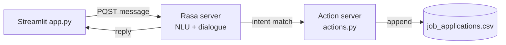

<h1 align="center">JobQuest AI</h1>
<p align="center"><b>A Rasa-based conversational assistant that answers candidate questions and walks them through applying for a job.</b></p>

<p align="center">
  
  
  
</p>

JobQuest AI is an intent-based chatbot built on the Rasa framework. It
recognizes what a candidate is asking (job openings, application status,
company info, salary/benefits, requirements, ...), walks them through
submitting an application, and hands structured applicant details off to a
custom action for storage. A small Streamlit page provides a chat UI in
front of the Rasa server.

## How it works

- **NLU** (`data/nlu.yml`): training examples for 13 intents, from `greet`
  and `job_openings` through `apply_job`, `inquire_salary`, and
  `inquire_requirements`.
- **Dialogue** (`data/stories.yml`, `data/rules.yml`, `domain.yml`): maps
  recognized intents to scripted responses and conversation flow.
- **Custom action** (`actions/actions.py`): `ActionJobApplication` reads
  the collected applicant details out of the conversation and appends them
  to `job_applications.csv`.
- **Frontend** (`app.py`): a one-page Streamlit app that posts user
  messages to the Rasa server and renders the bot's replies.



## Running it

You'll need Python 3.8+ and the Rasa stack:

```bash
pip install rasa rasa-sdk streamlit requests

# train an NLU/dialogue model from data/ + domain.yml
rasa train

# terminal 1: the action server (runs actions.py)
rasa run actions --port 5056

# terminal 2: the Rasa server
rasa shell --port 5006 --endpoints endpoints.yml

# terminal 3: the Streamlit UI
streamlit run app.py
```

`rasa train` produces a `.tar.gz` model artifact under `models/`; that
directory is gitignored since models are build output, not source.

## Repository layout

```
data/         NLU training examples, stories, and rules
actions/      custom action server (writes applications to CSV)
domain.yml    intents, slots, and response templates
app.py        Streamlit chat frontend
tests/        story-based conversation tests (rasa test)
```

## Roadmap

- Wire the chatbot up to a real job-postings API instead of the
  hard-coded openings list in `domain.yml`.
- Replace the CSV sink with a real datastore.
- Multilingual intent recognition.